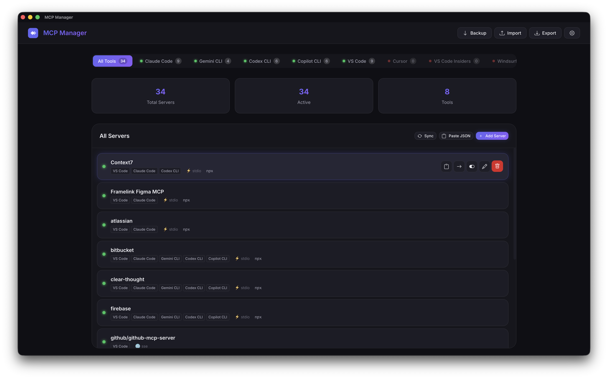
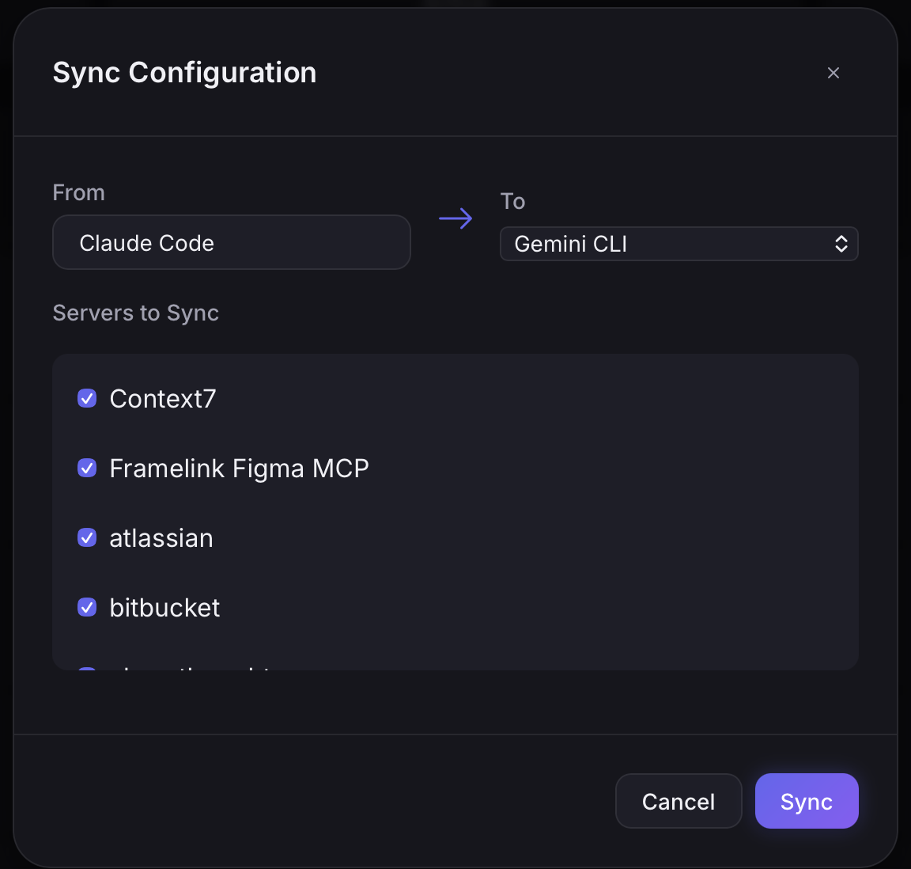

# MCP Manager

<p align="center">
  
</p>

<p align="center">
  <strong>A lightweight desktop app to manage MCP configurations across multiple AI tools</strong>
</p>

<p align="center">
  
  
  
</p>

<p align="center">
  
</p>

---

## Visual Overview

### Unified Dashboard
Manage all your MCP servers in one place. Toggle them on/off, edit configurations, or copy as JSON.

<p align="center">
  
</p>

### Easy Configuration
Add servers using pre-built templates or create custom ones for any tool.

<div align="center">
  
</div>

### One-Click Sync
Propagation your configurations across all supported AI tools with ease.

<div align="center">
  
</div>

### Quick Import
Paste JSON configuration snippets to quickly add servers to your setup.

<div align="center">
  
</div>

---

## Features

| Feature | Description |
|---------|-------------|
| 🔗 **Unified Dashboard** | View all MCP servers across all AI tools in one place |
| 🧩 **Custom AI Tools** | Add your own AI tools with custom config paths and formats (JSON/TOML) |
| ⚙️ **Custom Paths** | Configure custom config file locations in Settings |
| 📋 **Paste JSON** | Quickly add servers by pasting config snippets |
| 🔄 **Sync** | Copy configurations between tools with one click |
| 💾 **Backup & Restore** | Create snapshots of all your configurations |
| 📦 **Import/Export** | Share configurations as JSON files |
| ⚡ **Templates** | 8 pre-built MCP server templates for quick setup |
| 🎨 **Modern UI** | Dark mode with glassmorphism design |

## Supported AI Tools

| Tool | Default Config Path |
|------|---------------------|
| Claude Code | `~/.claude.json` |
| Gemini CLI | `~/.gemini/settings.json` |
| Codex CLI | `~/.codex/config.toml` |
| Copilot CLI | `~/.copilot/mcp-config.json` |
| VS Code | `~/Library/Application Support/Code/User/mcp.json` |
| Cursor | `~/Library/Application Support/Cursor/User/mcp.json` |
| VS Code Insiders | `~/Library/Application Support/Code - Insiders/User/mcp.json` |
| Windsurf | `~/.codeium/windsurf/mcp_config.json` |

> 💡 **Tip**: You can customize these paths in **Settings** (⚙️ button) if your config is in a different location.

## Installation

### Step 1: Download
Download `MCP-Manager-signed.dmg` from [Releases](https://github.com/naufaldirfq/mcp-manager/releases)

### Step 2: Install
Open the DMG and drag **MCP Manager** to your Applications folder.

### Step 3: First Launch (Important!)

Since the app is not notarized with Apple, macOS will show a security warning. Use one of these methods to open it:

#### Option A: Right-Click to Open (Recommended)
1. **Right-click** (or Control+click) on MCP Manager in Applications
2. Select **"Open"** from the context menu
3. Click **"Open"** in the security dialog

#### Option B: Terminal Command
Run this command after installing:
```bash
xattr -cr "/Applications/MCP Manager.app"
```
Then double-click to open normally.

> ⚠️ You only need to do this once. After the first launch, the app will open normally.

---

## Build from Source

**Prerequisites:**
- [Node.js](https://nodejs.org/) (v18+)
- [Rust](https://rustup.rs/)

```bash
# Clone the repository
git clone https://github.com/naufaldirfq/mcp-manager.git
cd mcp-manager

# Install dependencies
npm install

# Build the app
npm run build
```

The built app will be at:
- **macOS App**: `src-tauri/target/release/bundle/macos/MCP Manager.app`
- **DMG Installer**: `src-tauri/target/release/bundle/dmg/MCP Manager_*.dmg`

## Development

```bash
# Start development mode (hot reload)
npm run dev
```

## Project Structure

```
mcp-manager/
├── src/                      # Frontend (HTML/CSS/JS)
│   ├── index.html            # Main app shell
│   ├── main.js               # App logic
│   ├── styles/main.css       # Styling
│   └── services/api.js       # Tauri IPC client
├── src-tauri/                # Rust backend
│   ├── src/lib.rs            # Config parsers & commands
│   ├── tauri.conf.json       # App configuration
│   └── icons/                # App icons
└── templates/                # MCP server templates
    └── defaults.json
```

## Built-in Templates

| Template | Description |
|----------|-------------|
| Filesystem | Access local files and directories |
| GitHub | Interact with GitHub repositories |
| SQLite | Query SQLite databases |
| Fetch | Fetch and process web content |
| Memory | Persistent memory for conversations |
| Puppeteer | Browser automation |
| Slack | Interact with Slack workspaces |
| Brave Search | Web search via Brave API |

## Tech Stack

- **Frontend**: Vanilla JS + Vite
- **Backend**: Rust + Tauri v2
- **Styling**: Custom CSS with dark mode

## License

MIT

